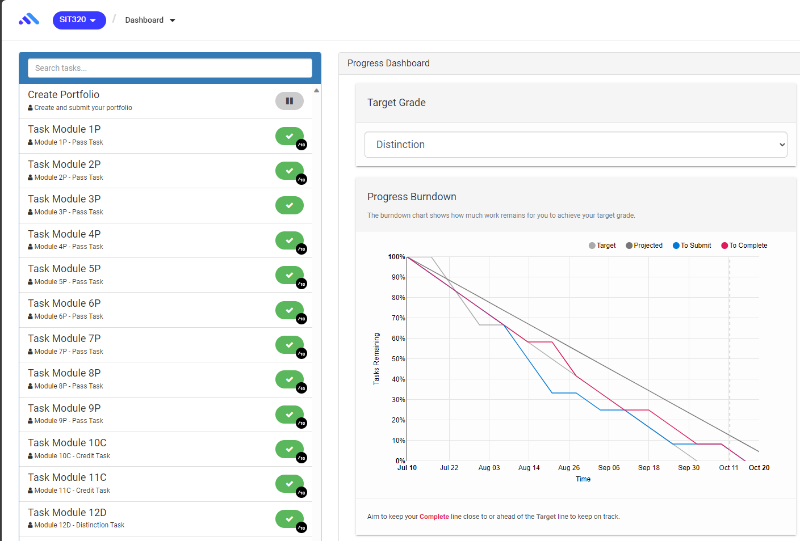

# Self-Assessment Details

## Self-Assessment Statement
|               | Pass      | Credit      | Distinction     | HD      |
|---------------|-----------|-------------|-----------------|---------|
| Self-Assessment|           |            |  ************** |         |

## Minimum Pass Checklist
- [ ] All nine (9) Pass tasks are Complete

## Minimum Credit Checklist (in addition to Pass Checklist)
- [ ] All two (2) Credit Tasks are Complete

## Minimum Distinction Checklist (in addition to Credit requirements)
- [ ] All one (1) Distinction tasks are Complete

## Declaration
I declare that this portfolio is my individual work. I have not copied from any other student’s work or from any other source except where due acknowledgment is made explicitly in the text, nor has any part of this submission been written for me by another person or automated system.

Signature: Benny T Pritchard

---

# Portfolio Overview
This portfolio includes work that demonstrates that I have achieved all Unit Learning Outcomes for SIT320 Advanced Algorithms to a distinction level.

Justification for Distinction Grade

**ULO1: Analyse complex scenarios and design software solutions**

**GLO1**: Achieved through extensive practice and application of algorithms and design patterns.
- By starting tasks early I gave myself time to think about the problems I was given. I put into practice the idea of iterative development, and the ability to break down a problem into smaller problems

**GLO5**: Realized through dissecting complex scenarios and solving them efficiently.
- Once I had a basic understanding of the problem I would read extensively about it. I then let that information perculate in my mind. Afterwards I would come back with a fresh perspective and a new understanding. I could often solve the problem in new ways after this process.

**ULO2: Implement, review, and evaluate software solutions**

**GLO1**: Achieved through extensive practice and application of algorithms and design patterns.
- Evaluating solutions with good test data was key. I found that input matters just as much as the algorithm itself when trying to debug a problem.

**GLO4**: Achieved by meticulously analyzing the quality and efficiency of solutions.
- I used VSCode tools such as Sourcery to help me analyze the quality of my code. This tool was useful for finding more efficient ways to write my code. It often reccomened refactors of small things like for loops, and simplifying return statements.

**ULO3: Clearly present relevant solution features**

**GLO1**: Achieved through extensive practice and application of algorithms and design patterns.
- From reading, writing and debugging I was able to gain useful insight into my code. I was also able to understand the way I write code. This allowed me to explain how and why I did certain things.

**GLO2**: Enhanced by constant practice in presenting solutions in understandable and relatable terms to different audiences.
- In my weekly discussions with Kiran I would image as though I was speaking to someone without knowledge of the topics. This way I could learn to articulate complex concepts.

**ULO4: Use software design tools**

**GLO3**: Displayed through the use of software tools in assignments and project work.
- - I used VSCode with the Jupyter extension. I also used Sourcery to help me refactor code. This tool gave me a ranking/score for the complexity and efficiency of my code. Lastly I used PlantUML to help me design the UML diagrams in the first few tasks.

---

# Reflection

## The most important things I learnt:
When learning something new, take your time and don't rush. It's better to take your time and understand the concepts than to rush and not understand anything. Things that seem conceptualy easy to understand often have highly complex implementations.

## The things that helped me most were:
Flexibile deadlines and the ability to work at my own pace. 
The way in which we were lead to a place that the answer would be apparent, rather than being told the answer. 
The affordablility to think about the problems we were given, and that not all of them had a clear cut answer. 
Quizing and writing about the topics I was learning. This helped me to understand the concepts more deeply.

## I found the following topics particularly challenging:
Module 10: Algorithm Analysis. I found the math involved in this module to be quite challenging.
Module 11: Flow Algorithms. How running a randomised algorithms multiple times can give you a more accurate result. This was conceptually challenging for me to understand and took much time to wrap my head around.

## I found the following topics particularly interesting:
The way Dynamic Programming was able to solve computationaly expensive problems. 
I also found Karger's algorithm to be facinating. It could possibly be that I spent much time reading about it or that I belive I have a decent understand of how these types of algorithms are concieved.

## I feel I learnt these topics, concepts, and/or tools really well:
Iterative devlopment, and the ability to break down a problem into smaller problems.
Input matters just as much as the algorithm itself when trying to debug a problem.
Graphs and tree search algorithms - they felt as though they were easy to translate to real world probelms.

## I still need to work on the following areas:
Intgerating prior knowledge or algorithms and data structures into new problems. 
I feel like I have a good understanding of the concepts, but I need to work on applying them to new problems. 
I would like to dive deeper into design principles and how to apply them to my code.

## My progress in this unit was …:

## This unit will help me in the future:
Now knowing that when presented with a difficult idea, problem or concept, it's okay to not understand it in the beginning. Things are not always aparent when you are first presented with it. But when you give yourself time, and have belief you can understand it, you will. I have already made a plan to seek out challenging problems that I can solve with what I have learnt in this unit. I plan to go through CLRS and solve some of the problems in there.

## If I did this unit again I would do the following things differently:
I would have coded more iteratively and testing my code more often. Crafting code that is modular seemed key to towards the end of the unit. Also I would have applied the process of first reading something, code a little, test a little, and repeat. I found that the action of coding something after reading just a little gave me a better understanding of the concepts. Which then allowed me to understand more deeply when I began to read more.
