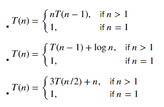
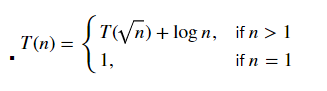
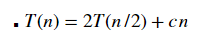
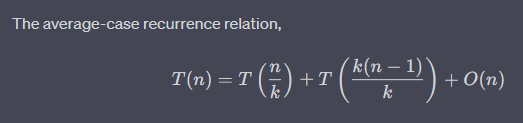

# SIT320 - Advanced Algorithms
## Credit Task 10: Algorithm Analysis
### School of Information Technology, Deakin University

---

## Overview of Learning (Module Summary)
[GitHub Link](https://github.com/bennyp85/sit320-advanced-algorithms/tree/master/module%2010)
[ChatGPT Link](https://chat.openai.com/share/2d601819-4ca4-4be5-8ad0-c7692192bde3)

---

## Problem 1: Solve Recurrence using Substitution Method

### Problem Statement

### Solution
*(Detail your solution step-by-step, using the substitution method)*

---

## Problem 2: Solve Recurrence using Master Theorem

### Problem Statement

### Solution
*(Detail your solution step-by-step, using the Master Theorem)*

---

## Problem 3: Solve Recurrence using Recursion Tree Method

### Problem Statement

### Solution
*(Detail your solution step-by-step, using the recursion tree method)*

---

## Problem 4: Complexity Analysis of Quick Sort Algorithm

### Problem Statement

### Solution
- In the case of Quicksort we will analyse the average case complexity. The average case is more appropriate for Quicksort because the worst case is very rare and the best case is not very useful. The reason the average case occurs more often is because the pivot is chosen randomly and the probability of choosing the worst pivot at each step is very low.

- [Link to Analysis](https://github.com/bennyp85/sit320-advanced-algorithms/blob/master/module%2010/task-four.md)
---

## References
*(List any academic papers, textbooks, or online resources you used for completing this task.)*

---

## Appendix
*(Include any additional material like code snippets, figures, or tables to support your analysis.)*
