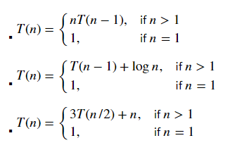
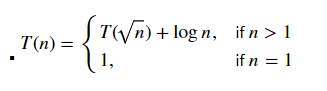

### SIT320 — Advanced Algorithms: Credit Task 10

**Algorithm Analysis**

**0. Overview:**
  - Provide an overview of the key learnings from the module, drawing from various resources such as lectures, cloud Deakin, interactions with faculty and peers, and personal research.
  - Include prompts from interactions with chatGPT if applicable.
  - Ensure a detailed one-page summary with emphasis on key takeaways.

**1. Recurrence with Substitution Method:**
  - Solve the given recurrence using the substitution method.
- 
---
**2. Recurrence with Master Theorem:**
  - Solve the specified recurrence using the Master Theorem.
- 
---
**3. Recurrence with Recursion Tree Method:**
  - Address the given recurrence using the recursion tree method.
- 
---
**4. Analysis of Select(A,k) Problem and Quick Sort Complexity:**
  - Based on the analysis of the select(A,k) problem in the module, analyze the complexity of the Quick Sort Algorithm.
  - The analysis must consider unbalanced sub-problems similar to the select(A,k) problem.
  - Utilize either the Akra-Baazi method or induction to solve the recurrence.
