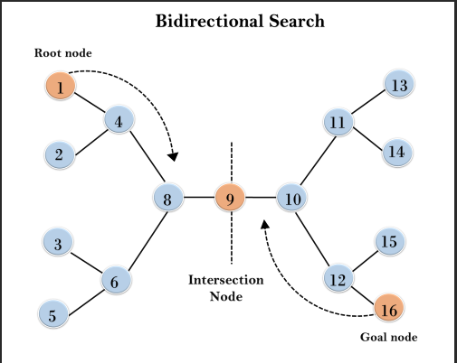
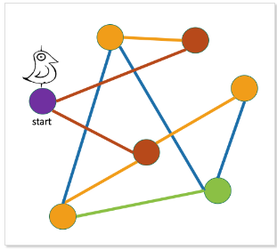

# SIT320: Advanced Algorithms - Lesson Review

## Overview

- Brief description of what was learned in this module.

## Task 1: Bidirectional Search

   
- Root node is the starting node.
- Goal node is the ending node.
- Intersection node is the node where the two searches meet. 

**Coding the Algorithm**
- Description of the algorithm designed for bidirectional search.
- Description of the implementation process in the Jupyter Notebook.
- Conceptual knowledge was fine, but implementation was difficult.
- Understanding the importance of the frontier and how it is used in the algorithm.
- By storing the paths in dictionaries, I was able to keep track of the paths from the start and end nodes.
- Using status names like, "VisitedByS" or "VisitedByT" helped me keep track of which nodes were visited by which search.
- Directed graphs may or may not have a path between two nodes, but undirected graphs will always have a path between two nodes.

## Task 2: BFS for Bipartite Graph Determination

 **Breadth First Search**                            

 
- Purple node is the starting node.
- Nodes that are one hop have red edges
- Nodes that are two hops have orange edges
- Nodes that are three hops have blue edges
- Nodes that are four hops have green edges
 
 **Bipartite Graph**

- Nodes in one set are colored red.
- Nodes in the other set are colored orange.
- No edge exists between nodes of the same color.

**Coding the Algorithm**
- Description of the designed algorithm using BFS to determine if a graph is bipartite.
- Description of the modification and implementation process of BFS in the lab notebook.

## Task 3: Finding Strongly Connected Components (SCCs)

- Components are **strongly connected** if there is a path between every pair of vertices in the component.

**Coding the Algorithm**
- Description of the algorithm for finding SCCs in a graph.
- Description of the process to extend the provided Node and Graph code.
- All vertices in a SCC can be reached from any other vertex in the SCC.
## Reflections 

- Discussion of interactions with the Unit Chair, Tutors, and Peers, research done, and interactions with ChatGPT.

## Conclusion

- Final thoughts and takeaways from the module.

## References

- List of references and resources used during the module.
