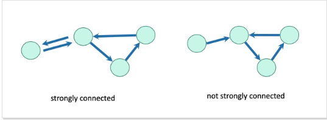

# SIT320: Advanced Algorithms - Lesson Review

## Overview
### [ChatGPT Link](https://chat.openai.com/share/9118beff-3518-4db7-80ec-616fdbf0360e)
### [GitHub Link](https://github.com/bennyp85/sit320-advanced-algorithms/tree/master/module%205)
- Throughout this module I expanded my knowledge of **graphs and graph algorithms**.
- These are important concepts to understand, as they are used in many **real-world applications**.
- Such applications include:
  - Social Networks
  - Web Search
  - Routing Algorithms
  - GPS Navigation Systems
  - Computer Networks
  - and many more...

## Task 1: Bidirectional Search

   
- Root node is the starting node.
- Goal node is the ending node.
- Intersection node is the node where the two searches meet. 

**Coding the Algorithm**
- Set all vertices in the graph to **unvisited**.
- Create two dictionaries to store the **paths from the start and end nodes**.
- Set start node and end node to visited.
- Perform a BFS on the start node and store the paths in the dictionary.
- Perform a BFS on the end node and store the paths in the dictionary.
- Update **layers of the frontier** until the intersection node is found.
- Conceptual knowledge was fine, but implementation was difficult.
- Understanding the importance of the frontier and how it is used in the algorithm.
- By storing the paths in dictionaries, I was able to keep track of the paths from the start and end nodes.
- Using status names like, **"VisitedByS" or "VisitedByT"** helped me keep track of which nodes were visited by which search.
- Directed graphs may or may not have a path between two nodes, but undirected graphs will always have a path between two nodes.

## Task 2: BFS for Bipartite Graph Determination

 **Breadth First Search**                            

 
- Purple node is the starting node.
- Nodes that are one hop have red edges
- Nodes that are two hops have orange edges
- Nodes that are three hops have blue edges
- Nodes that are four hops have green edges
 
 **Bipartite Graph**

- Nodes in one set are colored red.
- Nodes in the other set are colored orange.
- No edge exists between nodes of the same color.

**Coding the Algorithm**
- Similar to the BFS algorithm, but with a few modifications.
- The Node class was modified to include a **color attribute**.
- Set all vertices in the graph to unvisited.
- Set the color of the starting node to blue.
- Initialize a queue with the starting node.
- While the queue is not empty:
  - Dequeue a node from the queue.
  - For each adjacent node:
    - If the adjacent node is unvisited:
      - Set the color of the adjacent node to the **opposite color** of the current node.
      - Enqueue the adjacent node.
    - If the adjacent node is visited:
      - **If the adjacent node has the same color** as the current node:
        - Return False.
- Return True.

## Task 3: Finding Strongly Connected Components (SCCs)

- Components are **strongly connected** if there is a path between every pair of vertices in the component.

**Coding the Algorithm**
- Do a DFS and keep track of the **finish times** of each node.
- Reverse the graph.
- Do a DFS on the reversed graph in order of **decreasing finish times**.
- Each DFS tree is a **strongly connected component**.

## Reflections 

- Discussion of interactions with the Unit Chair, Tutors, and Peers, research done, and interactions with ChatGPT.
- Mistake on slide 163 of the lecture notes. After the puppy is marked as Finish:5 -> New York Times is marked as Start:7 **Missing Start:6**.
- The example Graph given in the code for Task 3 had cycles. This produced an error when trying to find the SCCs. I had to modify the code to remove the cycles. 
- This caused the SCCs to be different than what was shown in the lecture slides.
- Spent a lot time **debugging** the code for Task 3.
## Conclusion
- Used the sorted() function with a **lambda expression** to sort the values in decreasing order.
- This is the first time I have used the sorted() function with a lambda expression.
- **Input data** is just as important as the algorithm used to process it. I will pay attention to this in the future.
- Creating my own **test data** is going to be a priority for future modules.
- Simple pseudo-code algorithms can be difficult to implement in code.
- Thinking high-level and then being able to zoom into the problem can help with the implementation.
- Still focused on Polya's advice about **solving the smallest problem first**.
    - For example I often solved the problem for a single node, or two nodes, and then expanded it to the entire graph.

## Readings
- **Algorithms Illuminated Part 2 - Tim Roughgarden**
    - Chapter 8: Graph Search and its Applications