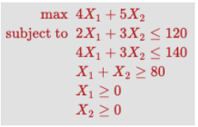
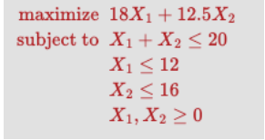

### Overview of Learning:
- **Understanding Linear Programming:** Explored concepts like objective functions, constraints, feasible regions, graphical solutions, and optimization methods like Simplex.
- **Computational Techniques:** Learned about LU decomposition and solving linear equations using forward and backward substitution.
- **Real-World Applications:** Discussed how linear programming is applied in various fields like economics, logistics, and artificial intelligence.
- **Ethical Considerations:** Delved into the implications of optimization algorithms in societal decision-making and resource allocation.

### Graphical Solution:

1. Identify the constraints and plot them on a 2D graph.
2. Determine the feasible region as the intersection of these constraints.
3. Plot the level curves of the objective function.
4. Identify the optimal solution by examining where the level curves intersect the feasible region.

### Code for Solving Linear Equations (y = Ax) using LU Decomposition:
```python
def lu_decomposition(A):
    # Code for LU decomposition
    return L, U

def forward_substitution(L, b):
    # Code for forward substitution
    return y

def backward_substitution(U, y):
    # Code for backward substitution
    return x

A = # Your matrix
b = # Your vector
L, U = lu_decomposition(A)
y = forward_substitution(L, b)
x = backward_substitution(U, y)
```
### Solve Linear Program Using Simplex:

1. Convert the problem into standard form if needed.
2. Identify the initial basic feasible solution.
3. Use pivot operations to traverse the feasible region.
4. Continue until you reach the optimal solution.

### Reflect on the Experience:
- Relate these concepts to Inspirational Figures and their insights.
- Reflect on how linear programming intertwines with philosophy, ethics, and societal needs.
- Explore additional resources like those mentioned in your books and resources section.
